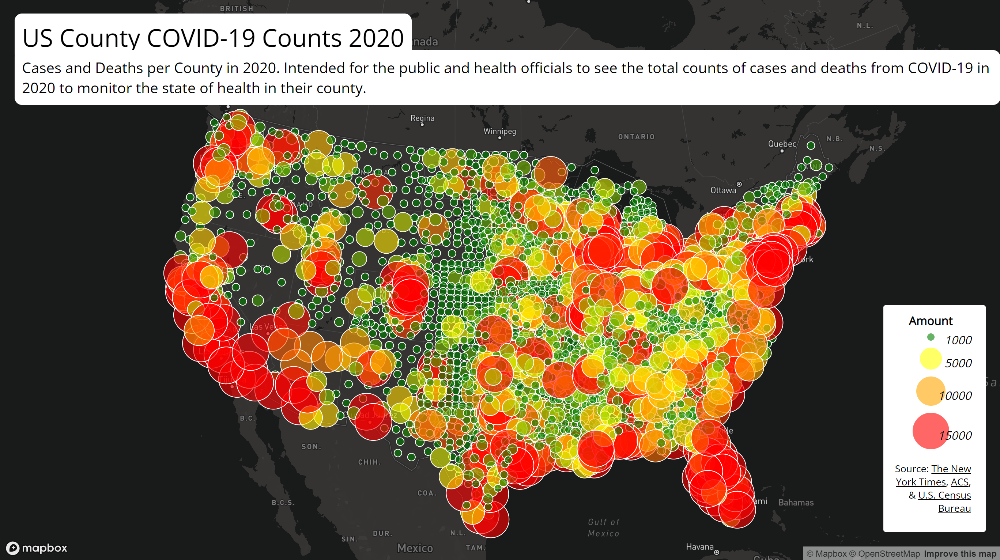

# U.S. County COVID-19 Maps

This project contains two interactive maps that project the U.S. counties' case counts and case rates during the year 2020. They are intended for the public and health officials to view and explore in order to get a better understanding of the state of health in their counties as well as the state of the virus.

## Primary Functions
Each map have different primary functions. The first map, U.S. County COVID-19 **Case Rates** Map, is a choropleth map that allows users to hover over each county to view more information. Upon hovering over the county, users are given information on the county population, number of cases, and the rate of cases per thousand residents. Additionally, users are able to see how high the case rates are in a county based on the color of each county. The redder the county, the higher the case rate.

The second map, U.S. County COVID-19 **Case Counts** Map, is a proportional symbols map that allows users to click on a point to view more information. Upon clicking on a point, users are given information on the county case counts and death counts. Additionally, users are able to see how impactful the case counts are through the size and color of the symbols. The bigger the symbol, the more case counts there are.

## Maps
### U.S. County COVID-19 Case Rates Map
[View it for yourself!](https://soshikun.github.io/covid19-us-county-cases/map1)

### U.S. County COVID-19 Case Counts Map
[View it for yourself!](https://soshikun.github.io/covid19-us-county-cases/map2)

## Libraries
These maps were built from the [Mapbox API](https://docs.mapbox.com/mapbox-gl-js/api/) library.

## Data Sources
- [The New York Times](https://github.com/nytimes/covid-19-data/blob/43d32dde2f87bd4dafbb7d23f5d9e878124018b8/live/us-counties.csv)
- [ACS](https://data.census.gov/cedsci/table?g=0100000US.050000&d=ACS%205-Year%20Estimates%20Data%20Profiles&tid=ACSDP5Y2018.DP05&hidePreview=true)
- [U.S. Census Bureau](https://www.census.gov/geographies/mapping-files/time-series/geo/carto-boundary-file.html)

## Credits & Acknowledgements
Maps created by [Jun Nguyen](https://github.com/Soshikun).

Special thanks to [Bo Zhao](https://github.com/jakobzhao) for providing most of the necessary code.
